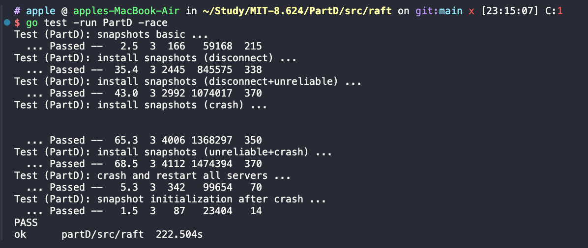
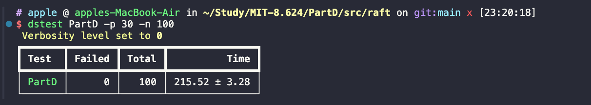
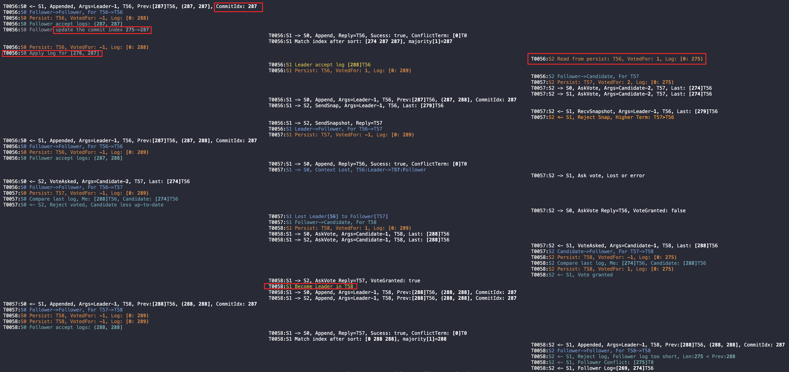

# MIT-8.624 Raft Implement

# 简介
- PartA：实现了无日志同步的领导者选举功能（通过 lab 测试以及并发测试）
- PartB：在 PartA 基础上实现了日志同步
- PartC：在 PartB 基础上实现了日志持久化

PartD 实现了
1. 领导者选举
2. 日志同步（matchIndex 数组进度取半数以上）
3. 日志持久化
4. 日志压缩

# 代码结构
```
├── go.mod
├── resource
│   └── images
├── src
│   ├── README.md
│   ├── labgob
│   │   ├── labgob.go
│   │   └── test_test.go
│   ├── labrpc
│   │   ├── labrpc.go
│   │   └── test_test.go
│   └── raft
│       ├── config.go
│       ├── out.txt
│       ├── persister.go
│       ├── raft.go
│       ├── raft_application.go
│       ├── raft_compaction.go
│       ├── raft_election.go
│       ├── raft_log.go
│       ├── raft_persistence.go
│       ├── raft_replication.go
│       ├── test_test.go
│       └── util.go
└── tools
    ├── dslogs
    └── dstest
```

# 第一关：实验测试

执行命令

```
go test -run PartD
go test -run PartD -race
VERBOSE=0 go test -run PartD -race | tee out.txt
```

# 第二关：并发测试

安装辅助测试插件

dslogs 和 dstest

脚本内容见 tools，在 mac 上：

```
sudo cp dslogs dstest /usr/local/bin
brew install python
pip3 install typer rich
```

执行 `dslogs -c 3 out.txt` 高亮分区查看日志（在 raft 目录下）
执行 `dstest PartD -p 30 -n 100` 进行并行测试

输入下面结果表示测试成功：







